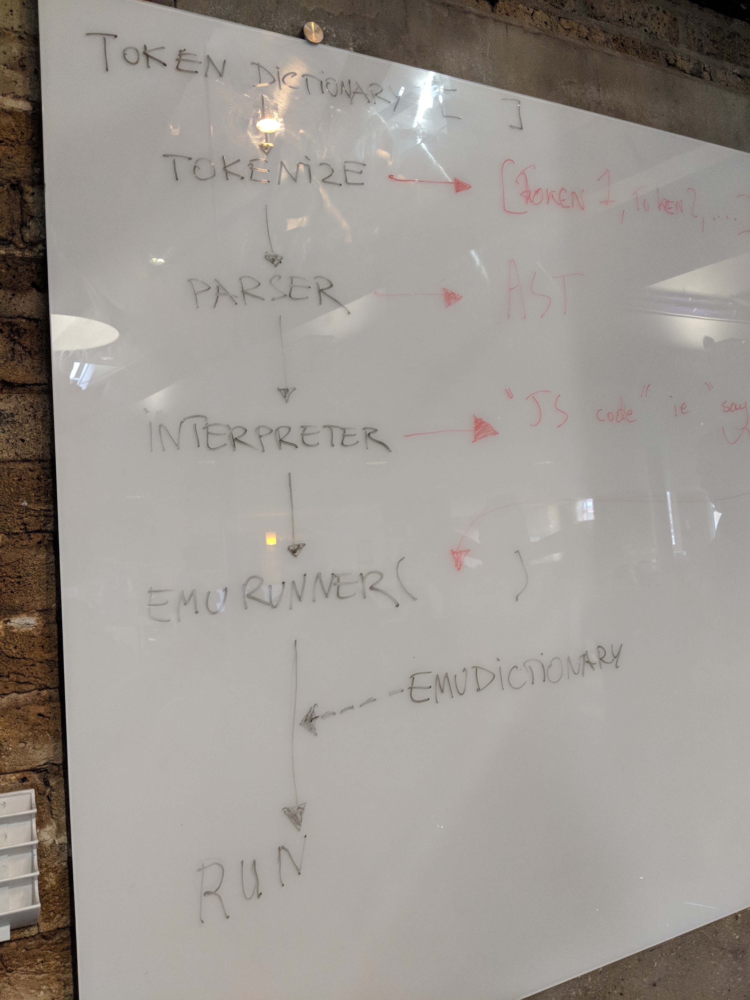

# Emu

Emu is a new programming language built on top of JavaScript.

Made by [Josué Estévez Fernández](https://github.com/Jestfer), [Justyna Zygmunt](https://github.com/Kotauror/), [Laura Chan](https://github.com/lwkchan), [Noel Vock](https://github.com/noel1uk) and [Matthew Burstein](https://github.com/MatthewBurstein).

# Documentation

The main aim of our project was to learn more about the structure of computer programming languages. When the user inputs Emu into our program, it goes through the following stages:

1. Tokenizer - *Splits input up into tokens*
2. Parser - *Organises tokens into an abstract syntax tree*
3. Interpreter - *Outputs the result of the input*

